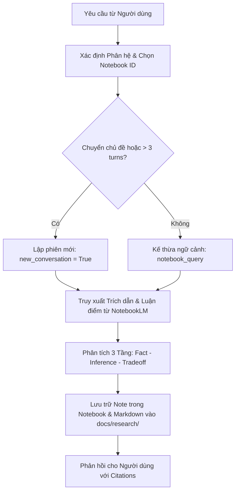

# NotebookLM Thesis Researcher & Banking AI Assistant Skill

Kỹ năng này chuẩn hóa quy trình sử dụng Google NotebookLM làm **Nguồn Chân lý Tối thượng (First Source of Truth)** và **Trợ lý Nghiên cứu & Phản biện Học thuật** cho toàn bộ dự án **AI Banking Assistant (GR2)**.

---

## 1. Nguyên tắc Ưu tiên Tuyệt đối (Absolute Priority Directive)

1. **NotebookLM First**: Khi người dùng đặt câu hỏi, yêu cầu thiết kế, thảo luận kiến trúc, viết code hoặc đánh giá thực nghiệm liên quan đến đề tài AI Banking Assistant, **BẮT BUỘC gọi MCP Server `gemini-notebook-mcp` để truy vấn tri thức nguồn trước khi đưa ra câu trả lời**.
2. **Đối soát & Trích dẫn Nguồn**: Mọi quyết định kỹ thuật, công thức toán học và chỉ số benchmark phải được đối soát từ tài liệu đã nạp trong NotebookLM kèm mã trích dẫn (`citations`).
3. **Cập nhật Tri thức Hai chiều**: Sau khi đạt được kết luận nghiên cứu quan trọng, chủ động lưu lại thành Note trong NotebookLM bằng công cụ `note` và đồng bộ vào thư mục `docs/research/`.

---

## 2. Bản đồ Sổ tay Nghiên cứu (Notebook Routing Map)

Luôn tự động định tuyến câu hỏi đến đúng Notebook ID tương ứng trong tài khoản `dophuhung.hn@gmail.com`:

| Phân hệ Nghiên cứu | Tên Sổ tay (Notebook Name) | Notebook ID | Phạm vi Tri thức & Nguồn tài liệu |
| :--- | :--- | :--- | :--- |
| **Kiến trúc & Đề tài GR2** | `AI Agent banking` | `1938151d-f91d-47df-b395-4b27aac0a211` | Đề xuất đề tài GR2, Kiến trúc hệ thống 4 tầng, Luồng dữ liệu 6 giai đoạn, Master Checklist, Guardrails HITL. |
| **Hệ thống AI Agent** | `AI Agent` | `f07ce8fc-f536-4624-af36-3f614e6637ca` | 245 tài liệu: CoALA, Wang et al., LangGraph StateGraph, ReAct, Tree-of-Thoughts, Reflexion, MCP Tool Layer. |
| **Kỹ thuật RAG Nâng cao** | `RAG` | `880c1277-4ac1-4b2b-9565-54913bda81df` | 33 tài liệu: Hybrid Search (BM25 + HNSW pgvector), RRF ($k=60$), Cross-Encoder Reranker, CRAG, Self-RAG, RAGAS. |
| **Phân đoạn Văn bản** | `Strategic Document Chunking...` | `d3f1452a-ba79-4ca9-875e-a5d7bb20ca74` | 46 tài liệu: Late Chunking, Contextual Retrieval, Table Chunking (Tree-sitter AST), giải quyết Bẫy đồng chỉ (Coreference Trap). |
| **Gian lận & An toàn Ngân hàng** | `Khảo sát về những gian lận trong ngân hàng` | `f3f23d9f-31db-4025-873e-fd47fec79a87` | 49 tài liệu: Kỹ thuật lừa đảo, rủi ro giao dịch, kiểm soát an toàn ngân hàng, phòng chống gian lận tài chính. |

---

## 3. Quy chuẩn Quản lý & Làm sạch Lịch sử Trò chuyện (Chat Session Hygiene)

Nhật ký hội thoại tích tụ lâu sẽ gây tràn ngữ cảnh, tăng độ trễ truy vấn và tiềm ẩn nguy cơ ảo giác (hallucination drift). Do đó, áp dụng quy chuẩn quản lý lịch sử nghiêm ngặt:

### A. Kích hoạt Phiên Hội thoại Mới (`new_conversation=True`)
* **Khi nào kích hoạt**:
  * Khi chuyển sang một chủ đề nghiên cứu mới (ví dụ từ RAG sang LangGraph Orchestration).
  * Định kỳ sau mỗi **3 đến 5 lượt trao đổi sâu** về cùng một chủ đề.
  * Khi người dùng yêu cầu phân tích một khía cạnh hoàn toàn độc lập.
* **Cách thực hiện qua MCP**:
  ```json
  {
    "notebook_id": "<notebook_id>",
    "query": "<câu_hỏi>",
    "new_conversation": true
  }
  ```
  *(Khi đặt `new_conversation=true`, NotebookLM sẽ khởi tạo phiên hội thoại mới tinh, xóa bỏ hoàn toàn ngữ cảnh rác của các lượt chat trước, đảm bảo câu trả lời luôn sạch và chuẩn xác nhất).*

### B. Lưu trữ Tri thức trước khi Reset Phiên
Trước khi xóa sạch ngữ cảnh hoặc bắt đầu phiên mới:
1. Nếu lượt chat vừa rồi đạt được kết luận nghiên cứu quan trọng, gọi công cụ `note` (`action="create"`) để lưu thành một thẻ ghi chú vĩnh viễn trong NotebookLM.
2. Kiểm tra danh sách phiên chat bằng công cụ `chat_list` để nắm bắt các phiên đang tồn tại trong sổ tay.

---

## 4. Quy trình Thực thi Nghiên cứu (Research Protocol)



1. **Bước 1 (Định tuyến)**: Xác định câu hỏi thuộc phân hệ nào và lấy đúng Notebook ID từ Bảng định tuyến.
2. **Bước 2 (Kiểm soát Ngữ cảnh)**: Nếu câu hỏi độc lập hoặc đã trao đổi nhiều lượt, bật cờ `new_conversation=true` khi gọi `notebook_query`.
3. **Bước 3 (Đối soát Bằng chứng)**: Đọc kỹ `citations` và `references` trả về để đảm bảo độ trung thực (**Faithfulness**).
4. **Bước 4 (Đồng bộ)**: Tạo Note hoặc cập nhật file nghiên cứu vào `docs/research/`.

---

## 5. Cơ chế Tự động Dọn dẹp Báo cáo & Tạo tác Lỗi (Automated Error Cleanup Protocol)

Để bảo đảm môi trường nghiên cứu và kho tài liệu luôn chuẩn xác, không bị rác bởi các tạo tác hỏng hoặc tải thất bại:

### A. Tự động Xóa Tạo tác Lỗi trên NotebookLM Studio (`Cloud-level`)
* Khi truy vấn trạng thái Studio (`studio_status`), nếu phát hiện bất kỳ tạo tác nào có:
  * Trạng thái: `status == "failed"` hoặc `status == "error"`.
  * Có lý do lỗi: `error_reason != null`.
* **Hành động bắt buộc**: Lập tức gọi `studio_delete` (hoặc `nlm studio delete <notebook_id> <artifact_id> --confirm`) để dọn sạch sổ tay, không để tạo tác lỗi chiếm dụng hạn ngạch hoặc làm rối danh mục Studio.

### B. Tự động Dọn dẹp Tệp Hỏng tại Ổ đĩa Cục bộ (`Local-level`)
* Sau khi thực hiện tải tạo tác (`download_artifact` hoặc `download_all_artifacts`):
  * **Kiểm tra tệp rỗng**: Quét các tệp có dung lượng 0 bytes và tự động xóa ngay.
  * **Kiểm tra tệp tạm**: Tự động xóa các tệp chưa tải hoàn chỉnh (`.tmp`, `.crdownload`, `.part`).
  * **Kiểm tra payload lỗi**: Nếu tệp có định dạng JSON/Text nhưng nội dung chứa chuỗi `{"status": "error"}` hoặc mã lỗi HTTP, xóa bỏ và ghi log.
* **Tự động hóa qua Script**:
  * Định kỳ chạy `python scripts/cleanup_failed_artifacts.py` để quét song song toàn bộ 5 sổ tay và các thư mục lưu trữ cục bộ.

---

## 6. Quy định Bắt buộc: Luôn Chọn Chế độ Deep Research (`mode: "deep"`)

Khi thực hiện tìm kiếm tài liệu mới hoặc kích hoạt tác vụ nghiên cứu mở rộng trong NotebookLM:
* **Tham số bắt buộc**: Truyền `"mode": "deep"` trong công cụ `research_start` (tuyệt đối KHÔNG sử dụng `"mode": "fast"`).
* **Mục đích học thuật**:
  * Chế độ **fast** chỉ quét sơ bộ (~30 giây, ~10 nguồn).
  * Chế độ **deep** (~5 phút, quét ~40 nguồn học thuật uy tín) khảo sát đa tầng trên toàn mạng, phát hiện các bài báo khoa học chất lượng cao, preprint arXiv và tài liệu kiến trúc thực tế.
* **Quy trình chuẩn**:
  1. Khởi chạy: `research_start(query="...", mode="deep", source="web", notebook_id="...")`.
  2. Theo dõi: `research_status(task_id="...", notebook_id="...")`.
  3. Nạp nguồn: `research_import(task_id="...", notebook_id="...")`.


